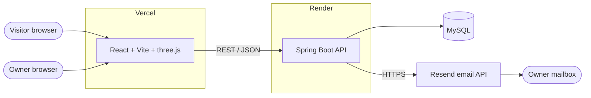
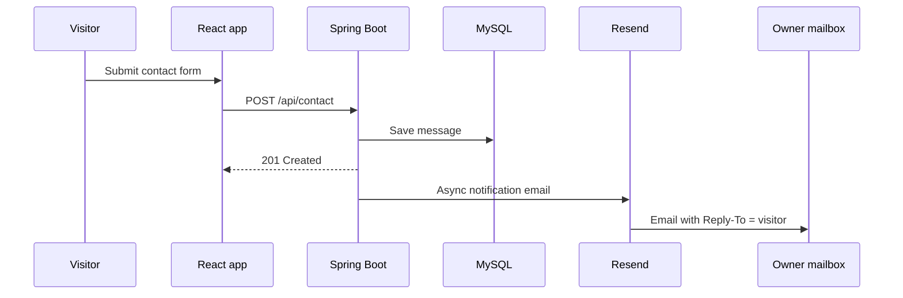

<div align="center">

# Jaganmohan Reddy · Developer Portfolio

**A full-stack, owner-managed portfolio with a 3D React front end and a Java Spring Boot API.**
Visitors explore projects, experience, skills and certificates and can send a message.
The owner signs in with a private key, edits everything from the browser, and reads messages in a built-in inbox.


[**Live site**](https://jmr-dev-portfolio-gilt.vercel.app) · [**API**](https://jmr-dev-portfolio.onrender.com) · [LinkedIn](https://www.linkedin.com/in/jaganmohanreddy33/) · [GitHub](https://github.com/JaganReddy-33)

</div>

<!-- Add screenshots: docs/screenshots/home.png, projects.png, inbox.png, mobile.png -->
<!--  -->

---

## Table of contents

- [Highlights](#highlights)
- [Features](#features)
- [Architecture](#architecture)
- [Tech stack](#tech-stack)
- [Project structure](#project-structure)
- [Getting started](#getting-started)
- [Configuration](#configuration)
- [Data model](#data-model)
- [API reference](#api-reference)
- [Email notifications](#email-notifications)
- [Deployment](#deployment)
- [Security](#security)
- [Performance and responsiveness](#performance-and-responsiveness)
- [Testing](#testing)
- [Troubleshooting](#troubleshooting)
- [Roadmap](#roadmap)
- [Author](#author)

---

## Highlights

- **No redeploys to update content.** Projects, experience, skills and certificates are managed in the browser through popup forms and stored in MySQL.
- **Owner-only controls.** Add, edit, delete and the message inbox appear only after signing in. The Java API enforces the key on every write, so hiding buttons is not the only protection.
- **Built-in inbox with notifications.** Contact messages are stored, shown with unread counts, and also emailed to the owner.
- **Smart ordering.** Experience and achievements always sort newest first, whatever order they were entered in.
- **Works even when the API is asleep.** The site renders instantly from seeded content and syncs with the server when it responds.
- **Layered backend.** Controller, service, repository, model, DTO, security and exception packages, with validation and tests.

## Features

### For visitors
- 3D landing page: GPU-animated particle-wave background (three.js), tilting photo with orbiting rings, typing headline, live counters.
- **Stack:** skills grouped into boxes (Java & Backend, Frontend, ...) plus a scrolling tech marquee.
- **Experience:** timeline with start and end dates, an "ongoing" state, technologies used and highlights.
- **Projects:** equal-size cards with a preview, a title, two bullet points, tech tags and Code / Live links. Clicking a card opens a popup with the full details.
- **Achievements:** certificates, workshops and publications with image previews and credential links, behind a Projects / Achievements filter.
- **Resume:** live preview, download and open-in-new-tab, served from Google Drive so updating the Drive file updates the site.
- **Contact form** with server-side validation and a character counter.
- Light and dark theme, mobile menu, keyboard-accessible controls and a reduced-motion setting.

### For the owner (after Owner login)
- **Add / edit / delete** skills, experience, projects and achievements from popup forms, including image upload with preview.
- **Smart skill boxes:** adding a skill under an existing heading merges into that box. A new heading creates a new box.
- **Floating inbox** (envelope button, bottom right):
  - Unread badge that drops as messages are read, and the unread count in the browser tab title.
  - Compact rows (initial, name, time) that expand on hover or click to show email, role, full message and received time.
  - Reply by email opens a pre-filled Gmail compose window, with Outlook and mail-app links as fallbacks, and a copy-email button.
  - Mark read / unread, mark all read, delete, search, and All / Unread tabs.
  - Read state is stored on the server, so it syncs across devices.
- **Email notification** for every new message, with Reply-To set to the visitor.
- Live hero counters (projects, experiences, skills, certificates) that update from your data.

## Architecture



Request path inside the API:

```
HTTP request -> CORS -> AdminKeyInterceptor -> Controller -> Service -> Repository -> MySQL
```

How a contact message flows:



**Design decisions**

- Skills, experience, projects and achievements are stored as validated JSON documents in one table. Adding a field to a card needs no database migration.
- The browser keeps a local copy of the content (seeded on first load). Every change is mirrored to the API, and server data wins when it exists.
- Email goes through an HTTP API instead of SMTP, because Render's free web services block outbound SMTP ports (25, 465, 587).

## Tech stack

| Layer | Technologies |
|---|---|
| Frontend | React 18, Vite 5, three.js (custom GPU shader), plain CSS (custom properties, 3D transforms) |
| Backend | Java 17+, Spring Boot 3.3, Spring Web, Spring Data JPA (Hibernate), Bean Validation |
| Database | MySQL 8 (H2 in-memory for tests) |
| Email | Resend HTTP API (optional) |
| Hosting | Vercel (frontend), Render with Docker (backend), any managed MySQL |

## Project structure

```
portfolio/
├── frontend/                          # Vite + React
│   ├── index.html
│   ├── public/                        # favicon
│   └── src/
│       ├── main.jsx · App.jsx
│       ├── pages/                     # Home.jsx
│       ├── components/
│       │   ├── layout/                # Navbar, Footer, ThreeBackground
│       │   ├── sections/              # Hero, Skills, Experience, ProjectsSection, Contact
│       │   ├── cards/                 # ProjectCard, AchievementCard
│       │   ├── forms/                 # Skill, Experience, Project, Achievement forms
│       │   ├── modals/                # ResumeModal, OwnerLoginModal, ProjectDetailModal
│       │   └── ui/                    # FloatingInbox, Modal, Acts, Icons, Counter, ImagePicker, ...
│       ├── context/                   # OwnerContext, DataContext
│       ├── hooks/                     # useCollection, useForm, useReveal, useTypewriter
│       ├── services/                  # api.js (HTTP client)
│       ├── utils/                     # dates.js (sorting), text.js, helpers.js, storage.js
│       ├── config/ · data/ · assets/
│       └── styles/                    # base, components, sections, polish, inbox
└── backend/                           # Spring Boot (layered)
    ├── Dockerfile · pom.xml
    └── src/
        ├── main/java/com/jmr/portfolio/
        │   ├── controller/            # Content, Contact, Auth
        │   ├── service/               # ContentService, ContactService, NotificationService
        │   ├── repository/            # Spring Data JPA repositories
        │   ├── model/                 # ContentDoc, ContactMessage (entities)
        │   ├── dto/                   # ContactRequest (validated record)
        │   ├── security/              # AdminKeyInterceptor
        │   ├── config/                # WebConfig (CORS + interceptor)
        │   └── exception/             # GlobalExceptionHandler
        ├── main/resources/            # application.properties (no secrets)
        └── test/java/                 # MockMvc tests
```

## Getting started

**Prerequisites:** Node 18+, JDK 17+, Maven 3.9+, MySQL 8, Git.

### 1. Clone

```bash
git clone https://github.com/JaganReddy-33/jmr-dev-portfolio.git
cd jmr-dev-portfolio
```

### 2. Backend

Secrets never go in `application.properties`. Create a private file `backend/application-local.properties` (it is git-ignored, and sits next to `pom.xml`):

```properties
spring.datasource.password=YOUR_LOCAL_MYSQL_PASSWORD
app.admin-key=YOUR_ADMIN_KEY            # at least 8 characters, required
# optional email notifications
# app.notify.resend-api-key=re_...
# app.notify.to=you@example.com
```

Run with the `local` profile:

```bash
cd backend
mvn spring-boot:run -Dspring-boot.run.profiles=local
```

The API starts on **http://localhost:8081** and creates the database `portfolio` if it does not exist. Check it:

```bash
curl -i http://localhost:8081/api/content/skills     # 200 and []
```

### 3. Frontend

```bash
cd frontend
npm install
```

Create `frontend/.env.development` (or `.env.local`):

```env
VITE_API_URL=http://localhost:8081
VITE_RESUME_FILE_ID=<your Google Drive file id>
```

```bash
npm run dev            # http://localhost:5173
npm run dev -- --host  # also reachable from your phone on the same Wi-Fi
```

Vite reads env files only at startup, so restart it after changing them. Scroll to the footer, click **Owner login** and enter your `ADMIN_KEY`.

### 4. Run the backend in Docker (optional)

```bash
docker build -t portfolio-api backend
docker run -p 8080:8080 -e PORT=8080 -e ADMIN_KEY=your-strong-key \
  -e DB_URL="jdbc:mysql://host.docker.internal:3306/portfolio?createDatabaseIfNotExist=true&useSSL=false&allowPublicKeyRetrieval=true" \
  -e DB_USERNAME=root -e DB_PASSWORD=your-password portfolio-api
```

## Configuration

### Backend (environment variables)

| Variable | Required | Default | Purpose |
|---|---|---|---|
| `ADMIN_KEY` | **Yes** | none | Owner key (at least 8 characters). The app refuses to start without it. |
| `DB_URL` | Prod | local MySQL | JDBC URL of the database |
| `DB_USERNAME` | Prod | `root` | Database user |
| `DB_PASSWORD` | Prod | empty | Database password |
| `APP_CORS_ALLOWED_ORIGINS` | Recommended | Vercel URL, `http://localhost:5173` | Comma-separated frontend origins allowed to call the API |
| `PORT` | No | `8081` | HTTP port (hosts like Render set it automatically) |
| `RESEND_API_KEY` | No | none | Enables email notifications |
| `NOTIFY_EMAIL` | No | none | Where notifications are sent |
| `NOTIFY_FROM` | No | `Portfolio <onboarding@resend.dev>` | Sender (use a verified domain in production) |
| `SITE_URL` | No | none | Adds a link to your site in the email |
| `SHOW_SQL` | No | `false` | Log SQL statements |

`SPRING_DATASOURCE_URL`, `SPRING_DATASOURCE_USERNAME` and `SPRING_DATASOURCE_PASSWORD` also work and take priority.

### Frontend (Vite env)

| Variable | Purpose |
|---|---|
| `VITE_API_URL` | Base URL of the API, with no trailing slash |
| `VITE_RESUME_FILE_ID` | Google Drive file id of the resume. Share the file as **Anyone with the link can view**. |

### Resume from Google Drive

The file id is the part of the share link between `/d/` and `/view`. Replace the file in Drive (keep the same file) and the site always shows the latest version.

## Data model

Content collections are `skills`, `experience`, `projects` and `ach` (achievements). Each item is a JSON object with an `id`.

```jsonc
// skills
{ "id": "k1", "head": "Java & Backend", "items": ["Core Java", "JDBC", "Spring Boot"] }

// experience: dates drive the ordering, "current" = ongoing role
{ "id": "e1", "role": "Web Development Intern", "org": "Company", "start": "2025-11", "end": "2026-02",
  "current": false, "period": "Nov 2025 – Feb 2026", "tech": "React, Node.js, MongoDB",
  "pts": "Highlight one|Highlight two" }

// projects: description points are separated by a bullet or a new line
{ "id": "p1", "title": "Seatline", "desc": "• Point one\n• Point two", "tech": "MongoDB,Express,React",
  "code": "https://github.com/...", "live": "", "img": "data:image/jpeg;base64,..." }

// achievements
{ "id": "a1", "title": "Oracle AI Foundations", "org": "Oracle", "date": "2023-05",
  "type": "Certificate", "link": "", "img": "" }
```

**Ordering rules**

- Experience: ongoing roles first, then by end date, then by start date (newest first).
- Achievements: newest first, items without a date last.
- Older items with free-text dates (for example `"Nov 2025 – Feb 2026"` or `"2023"`) are parsed automatically.

Uploaded images are resized to 640px in the browser and stored in the JSON. Each item is limited to about 2 MB.

Contact messages are stored in their own table (`contact_messages`) with `name`, `email`, `subject` (the role or topic), `message`, `createdAt` and `seen`.

## API reference

Base URL: `http://localhost:8081` locally. Owner endpoints require the header `X-Admin-Key: <ADMIN_KEY>`.

| Method | Endpoint | Access | Description |
|---|---|---|---|
| GET | `/api/content/{collection}` | Public | List items (`skills`, `experience`, `projects`, `ach`) |
| PUT | `/api/content/{collection}/{id}` | Owner | Create or update an item (JSON object, up to 2 MB) |
| DELETE | `/api/content/{collection}/{id}` | Owner | Delete an item |
| POST | `/api/contact` | Public | Submit a message (validated) |
| GET | `/api/messages` | Owner | List messages, newest first |
| PUT | `/api/messages/{id}/seen` | Owner | Body `{"seen": true}`: mark read or unread |
| POST | `/api/messages/seen-all` | Owner | Mark every message read |
| DELETE | `/api/messages/{id}` | Owner | Delete a message |
| GET | `/api/auth` | Owner | `204` if the key is valid |

**Status codes:** `200` OK, `201` created, `204` no content, `400` validation error (field errors returned as JSON), `401` missing or wrong key, `404` unknown collection or message.

```bash
# Public read
curl http://localhost:8081/api/content/projects

# Owner write
curl -X PUT http://localhost:8081/api/content/skills/k9 \
  -H "X-Admin-Key: $ADMIN_KEY" -H "Content-Type: application/json" \
  -d '{"id":"k9","head":"Cloud","items":["Docker","Render"]}'

# Visitor message
curl -X POST http://localhost:8081/api/contact -H "Content-Type: application/json" \
  -d '{"name":"Ada","email":"ada@example.com","subject":"Java Developer role","message":"Hello!"}'
```

## Email notifications

Each new contact message can be emailed to you. This is optional: with no key set, the app logs "Email notifications are off" and works normally.

1. Create a free account at [resend.com](https://resend.com), using the email address where you want notifications.
2. Create an API key (`re_...`).
3. Set `RESEND_API_KEY` and `NOTIFY_EMAIL` (your Resend account email) in the backend environment.

Notes:

- The default sender `onboarding@resend.dev` can only deliver to your own Resend account email, which is enough for owner notifications.
- Sending is asynchronous, and a failure is only logged, so it can never break the contact form.
- The email sets **Reply-To** to the visitor, so replying from your mailbox answers them directly.
- **Why not SMTP?** Render's free web services block outbound SMTP ports, so the API uses HTTPS instead.
- To email visitors from your own domain, verify the domain in Resend and set `NOTIFY_FROM`.

## Deployment

### Database
Create a managed MySQL database (any provider) and note its JDBC URL, user and password. Tables are created and updated automatically on startup (`ddl-auto=update`).

### Backend on Render
1. **New → Web Service**, connect the repository.
2. Root directory `backend`, runtime **Docker**.
3. Environment variables: `ADMIN_KEY`, `DB_URL`, `DB_USERNAME`, `DB_PASSWORD`, `APP_CORS_ALLOWED_ORIGINS` (your exact Vercel URL, no trailing slash), plus the optional email variables.
4. Deploy and check the logs for `Started PortfolioApplication`. Do not set `SPRING_PROFILES_ACTIVE=local` in production.

### Frontend on Vercel
1. **Add New → Project**, import the repository.
2. Root directory `frontend`, framework **Vite**.
3. Environment variables: `VITE_API_URL` (your Render URL) and `VITE_RESUME_FILE_ID`.
4. Deploy. Redeploy after changing any environment variable.

### Cold starts on free hosting
A free Render service sleeps when idle and takes up to about a minute to wake. The site shows its built-in content immediately and syncs when the API responds (content requests wait up to 20 seconds, the contact form up to 30). To keep it awake, add a free uptime monitor (for example UptimeRobot) that requests `/api/content/skills` every 5 minutes.

## Security

- **Owner key:** every write and the inbox require `X-Admin-Key`, checked on the server in constant time. The app refuses to start with a missing or short key (under 8 characters).
- **No secrets in git:** `application.properties` only contains `${...}` placeholders. Local secrets live in the git-ignored `application-local.properties`, and production secrets in host environment variables.
- **CORS** is limited to the origins you configure.
- **Validation:** contact fields are validated and size-limited, collection names and ids are whitelisted, and stored content must be a valid JSON object under 2 MB.
- **Emails are escaped:** message content is HTML-escaped before it goes into notification emails.
- **Always use HTTPS** in production, and a long random `ADMIN_KEY`.

**Known limitations:** the owner key is a single shared secret (no accounts, no expiry), and there is no rate limiting on the contact form yet. Both are listed in the roadmap.

## Performance and responsiveness

- The wave animation runs on the GPU in a vertex shader, with fewer particles and a 30 fps cap on touch devices. It pauses when the tab is hidden and respects reduced-motion.
- Phone address-bar resizes do not re-allocate the 3D canvas, and heavy blur effects were removed from scrolling areas.
- No horizontal scrolling on any screen size (`overflow-x: clip`, `100svh` sections), and the navbar collapses to a menu on small screens.
- Fixed-size project cards keep the layout stable. Images load lazily.
- Tested layouts: 375px phones through wide desktops (verify with Chrome DevTools device mode and a real phone).

## Testing

```bash
cd backend
mvn test
```

The MockMvc tests check that public reads work, that writes without a key return `401`, and that writes with a key succeed.

**Manual checklist before a release**
1. Owner login works, and add, edit and delete keep their changes after a refresh.
2. Experience and achievements sort newest first even when entered out of order.
3. Contact form saves a message, the inbox shows it, and the notification email arrives.
4. Opening a message lowers the unread count, and it stays read after a reload.
5. Resume preview, download and open-in-new-tab work.
6. No sideways scrolling and smooth scrolling on a phone.

## Troubleshooting

| Symptom | Cause and fix |
|---|---|
| Browser shows a CORS error on `localhost` | `VITE_API_URL` points to the wrong port or another program. Match it to the backend `PORT` (default 8081) and restart `npm run dev`. |
| `Access denied for user 'root' ... (using password: NO)` | The `local` profile is not active. Run with `-Dspring-boot.run.profiles=local` and check `application-local.properties` sits next to `pom.xml`. |
| `Set the ADMIN_KEY environment variable` on startup | `ADMIN_KEY` is missing or shorter than 8 characters. |
| Inbox says the server rejected your key | Use "Exit owner mode" in the footer and log in again with the current `ADMIN_KEY`. |
| Inbox says it can't reach the server (production) | The free host is waking up. Press refresh after a few seconds. |
| No notification email | Check the backend log for `Notification email failed`. `NOTIFY_EMAIL` must match your Resend account email when using `onboarding@resend.dev`. |
| Resume preview is blank | The Drive file is not shared as **Anyone with the link**. |
| Contact message only saved in the browser | The API was unreachable (for example asleep). Add an uptime monitor. |

## Roadmap

- Rate limiting and a honeypot field on the contact endpoint
- Replace the shared key with Spring Security and JWT
- Image storage on Cloudinary or S3 instead of data URLs
- Browser push notifications for new messages
- CI pipeline (build, test) and a Lighthouse budget

## Author

**Ragipalyam Jaganmohan Reddy**
Java Full-Stack Developer · Bengaluru, India · open to relocation

[LinkedIn](https://www.linkedin.com/in/jaganmohanreddy33/) · [GitHub](https://github.com/JaganReddy-33) · ragipalyamjaganmohanreddy@gmail.com

---

© 2026 Ragipalyam Jaganmohan Reddy. Source code is published to showcase this project. All rights reserved unless a `LICENSE` file states otherwise.